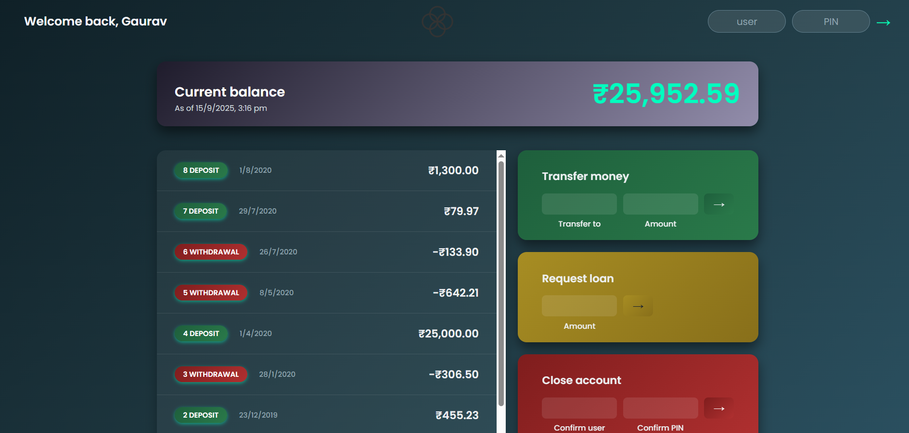
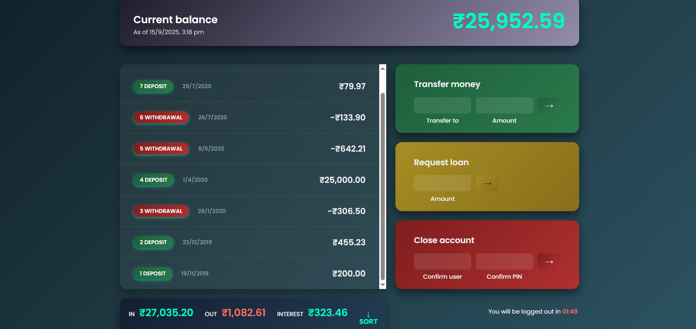
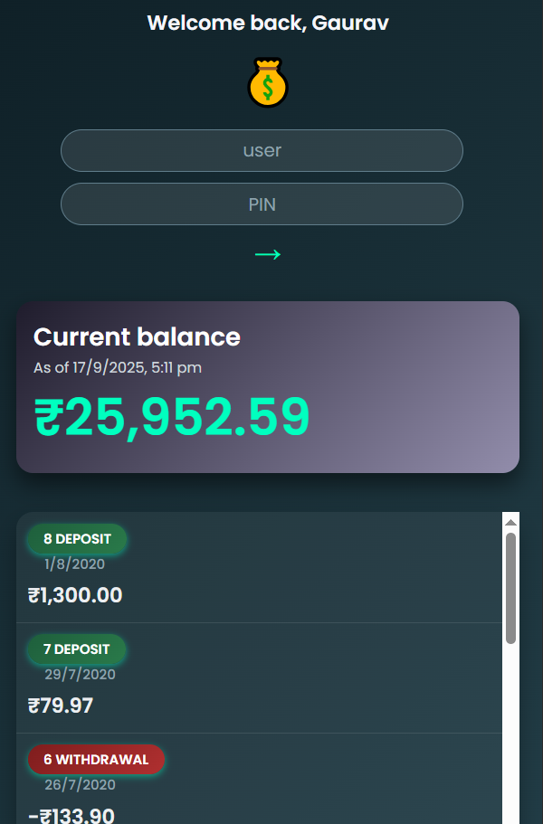

# 💳 FluxBank | Modern Banking Dashboard

**FluxBank** is a stylish, interactive banking web app that allows users to **log in, track transactions, transfer money, request loans, and close accounts**.  
Built with **HTML, CSS, and JavaScript**, it features **realistic banking operations**, dynamic UI updates, and a modern dark theme.

---

## 🎨 Features

- 🔑 Secure login with username & PIN
- 📊 View all **movements** (deposits & withdrawals) with dates
- 💸 Transfer money between accounts
- 🏦 Request loans with simple eligibility check
- ❌ Close your account
- 💰 Real-time **balance and summary** calculations
- 🕒 Logout timer for session security
- 🌙 Stylish **dark theme** with gradients and glow effects
- 📱 Fully responsive for desktop, tablet, and mobile

---

## 🕹️ How to Use

1. **Login**

   - Enter your **username** (first letters of your name, e.g., `gl` for Gaurav Lad)
   - Enter your **4-digit PIN**
   - Click the **arrow button** to log in

2. **View Movements**

   - Scroll through your **transaction list** in the movements panel
   - Deposits are **green**, withdrawals are **red**
   - Dates are formatted as "Today", "Yesterday", or "x days ago"

3. **Transfer Money**

   - Enter the **recipient's username** and the **amount**
   - Click the **arrow button** to send money
   - Both accounts are updated instantly

4. **Request Loan**

   - Enter the **loan amount**
   - Click the **arrow button**
   - Loan approved if you have a deposit >= 10% of requested amount

5. **Close Account**

   - Enter your **username** and **PIN**
   - Click the **arrow button** to permanently delete your account

6. **Sort Movements**

   - Click the **SORT** button to sort your transactions ascendingly

7. **Logout Timer**
   - A countdown timer shows **time left until automatic logout**
   - Performing actions **resets the timer**

---

## 🛠️ Built With

| Technology    | Purpose                                |
| ------------- | -------------------------------------- |
| 🧱 HTML5      | Structure and layout                   |
| 🎨 CSS3       | Styling, dark theme, responsive design |
| ✨ JavaScript | App logic, interactivity, dynamic UI   |
| 🌍 Intl API   | Date and currency formatting           |

---

## 📸 Screenshots

  

---

## 🌐 Live Demo

🔗 **Netlify Live Demo:**
[https://fluxbank-live.netlify.app](https://fluxbank-live.netlify.app)

---

## 📧 Let's Connect

🔗 **LinkedIn:**  
[https://www.linkedin.com/in/gaurav-lad1974](https://www.linkedin.com/in/gaurav-lad1974)

📨 **Email:**  
gauravlad1974@gmail.com
